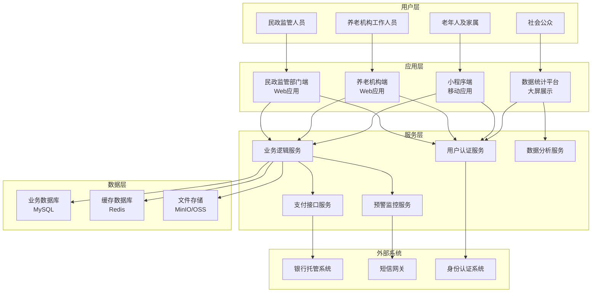

# 养老机构预收费资金监管平台技术方案

## 目录
1. [项目需求理解](#1-项目需求理解)
2. [总体方案](#2-总体方案)
3. [业务解决方案](#3-业务解决方案)

---

## 1. 项目需求理解

### 1.1 项目背景

#### 1.1.1 人口老龄化趋势分析
我国正面临前所未有的人口老龄化挑战。根据国家统计局数据，截至2023年底，我国60岁及以上人口已达2.97亿，占总人口的21.1%。其中，65岁及以上人口2.17亿，占总人口的15.4%。预计到2035年，我国60岁及以上老年人口将突破4亿，在总人口中的占比将超过30%，进入重度老龄化社会。

在这一背景下，养老服务业迎来了快速发展期，同时也暴露出诸多问题和挑战。传统的养老监管方式已经难以适应快速发展的养老服务业需求，迫切需要通过信息化手段提升监管效能。

#### 1.1.2 养老服务行业发展现状
近年来，我国养老服务机构数量快速增长，但质量参差不齐。截至2023年底，全国各类养老机构和设施达38.1万个，养老床位823.8万张。然而，行业发展过程中存在以下突出问题：

**市场规范不足：**
- 缺乏统一的收费标准和服务规范
- 机构准入门槛相对较低，监管体系不完善
- 服务质量参差不齐，难以有效评估和监督

**资金监管缺失：**
- 部分机构要求老人一次性缴纳数月甚至数年的费用
- 预收资金缺乏第三方监管，存在挪用风险
- 机构经营不善时，老人预缴资金难以追回

**信息化水平落后：**
- 传统监管方式效率低下，难以实现全过程监控
- 信息不对称问题突出，老人及家属知情权不足
- 缺乏有效的风险预警和应急处理机制

#### 1.1.3 现有问题分析

**资金安全风险：**
养老机构一次性收取高额服务费、押金、会员费的现象普遍存在。以某二线城市为例，中高端养老机构通常要求新入住老人一次性缴纳6个月至1年的��用，金额从数万元到数十万元不等。这些巨额资金缺乏有效监管，存在极大的安全隐患。

**典型案例分析：**
- 2022年某省养老机构突然倒闭，涉及200多位老人，预缴资金超过3000万元
- 2023年某养老机构负责人卷款跑路，造成老人经济损失超过1000万元
- 部分机构将预收资金用于其他投资，导致资金链断裂

**经营风险积累：**
- 盲目扩张：部分机构快速扩张，资金链紧张
- 投资失误：将预收资金用于高风险投资
- 管理不善：内部管理混乱，财务状况不透明

**监管手段滞后：**
- 依赖传统人工检查，难以实现实时监控
- 信息获取不及时，风险发现滞后
- 监管资源有限，难以覆盖所有机构

**老年人维权困难：**
- 信息不对称：老年人及家属对机构经营状况缺乏了解
- 维权成本高：法律程序复杂，时间成本和经济成本都很高
- 证据缺失：缺乏有效的资金使用记录和证据

### 1.2 项目目标

#### 1.2.1 总体目标
本项目旨在通过建设养老机构预收费资金监管平台，构建"政府监管、银行托管、机构自律、社会监督"四位一体的监管体系，实现预收费资金的全流程监管和风险防控，切实保障老年人合法权益，促进养老服务业健康有序发展。

#### 1.2.2 具体目标

**资金安全保障目标：**
- 建立银行资金托管机制，实现预收费资金与机构自有资金分离管理
- 确保老人预缴资金100%安全，杜绝挪用风险
- 建立资金使用全程追溯体系，每笔资金流向都有据可查
- 实现资金划拨的规范化、透明化运作

**监管效能提升目标：**
- 实现对养老机构资金状况的实时监控
- 建立智能化风险预警体系，风险识别准确率达到95%以上
- 监管响应时间缩短至24小时内，大幅提升监管效率
- 减少人工监管成本50%以上，提高监管覆盖面

**服务质量改善目标：**
- 规范养老机构收费行为，杜绝乱收费现象
- 提升收费透明度，让老人及家属明明白白消费
- 建立服务质量评价体系，促进机构提升服务水平
- 减少养老服务纠纷30%以上

**便民服务提升目标：**
- 为老年人提供便捷的线上缴费、查询、投诉服务
- 实现养老服务的"一站式"办理，减少跑腿次数
- 提供7×24小时在线服务，满足老年人多样化需求
- 适老化设计，确保老年人能够轻松使用

**决策支持强化目标：**
- 为政府部门提供实时、准确的行业数据支撑
- 建立养老服务业发展态势预测模型
- 为政策制定提供科学依据和决策支持
- 实现监管数据的可视化展示和分析

#### 1.2.3 预期效果

**短期效果（1年内）：**
- 覆盖全市80%以上的养老机构
- 监管资金规模超过10亿元
- 建立完整的风险预警体系
- 老年人满意度提升20%以上

**中期效果（2-3年）：**
- 形成完善的资金监管标准规范
- 实现跨区域数据共享和监管协同
- 建立养老服务信用评价体系
- 推动行业标准化、规范化发展

**长期效果（3-5年）：**
- 成为全国养老资金监管的示范标杆
- 推动养老服务业高质量发展
- 提升养老服务的可及性和可负担性
- 为积极应对人口老龄化提供有力支撑

### 1.3 项目主要建设内容

#### 1.3.1 系统架构建设

**民政监管部门端：**
作为政府监管的核心平台，为民政部门工作人员提供全方位的监管工具。该端包含机构准入审批、资金监管、风险预警、数据统计等核心功能，支持多层级、多部门的协同监管。通过可视化的数据展示和智能化的分析工具，帮助监管人员全面掌握行业动态，及时发现和处理风险隐患。

**养老机构端：**
为养老机构提供日常运营管理的综合平台，包含机构信息管理、入住管理、订单管理、费用申请等功能。通过规范化的业务流程和便捷的操作界面，帮助机构提升管理效率，降低运营成本。同时，该端与监管系统无缝对接，确保所有业务数据的实时同步和准确性。

**小程序端：**
专门为老年人及其家属设计的移动服务平台，采用适老化设计理念，界面简洁、操作便捷。提供机构查询、在线缴费、费用查询、投诉建议等功能，让老年人足不出户就能享受到便捷的养老服务。支持微信授权登录，简化注册流程，降低使用门槛。

**数据统计平台：**
基于大数据技术构建的决策支持平台，通过大屏可视化方式展示全市养老服务业的整体态势。包含机构分布、资金流向、风险预警、发展趋势等多个维度的数据分析，为政府决策提供科学依据。支持数据钻取、趋势分析、预测模拟等高级分析功能。

#### 1.3.2 核心功能模块

**机构准入管理系统：**
建立严格的养老机构准入机制，包含机构资质审核、信息备案、评级管理等功能。通过与工商、税务、消防等部门的数据对接，实现机构信息的综合核验。建立机构信用档案，记录机构的历史表现和违规记录，为监管决策提供参考。

**资金监管系统：**
与银行系统深度对接，实现预收费资金的全程监管。包含监管账户管理、资金划拨、对账管理等功能。采用多种风险控制措施，确保资金安全。支持多种支付方式，满足老年人多样化的支付需求。

**入住管理系统：**
为养老机构提供老人入住全过程管理，包含老人信息管理、床位管理、订单管理等功能。通过标准化的业务流程，确保入住过程的规范化和透明化。支持批量操作和数据导入，提升工作效率。

**预警监控系统：**
基于大数据和人工智能技术构建的智能预警系统，通过多维度数据分析，及时发现潜在风险。支持自定义预警规则，可根据实际情况调整预警阈值。建立预警处理闭环，确保每个预警都能得到及时有效的处理。

**统计分析系统：**
基于数据仓库和商业智能技术构建的决策支持系统，提供多维度的数据分析和报表功能。支持自定义报表和图表展示，满足不同用户的分析需求。建立数据挖掘模型，发现数据背后的规律和趋势。

#### 1.3.3 技术支撑体系

**银行接口集成：**
与多家银行建立深度合作，构建统一的金融服务接口。包含支付接口、账户查询、资金划转等功能。采用金融级的安全措施，确保资金交易的安全性和可靠性。支持7×24小时不间断服务，满足实时性要求。

**安全认证体系：**
建立多层次的安全防护体系，包含网络安全、数据安全、应用安全等多个层面。采用先进的加密技术和身份认证机制，确保系统和数据的安全。建立完善的权限管理体系，实现精细化的访问控制。

**运维监控体系：**
建立全方位的系统监控体系，实时监控系统运行状态和性能指标。建立自动化的运维管理平台，实现故障的自动发现和快速处理。建立完善的备份恢复机制，确保业务的连续性和数据的完整性。

**标准规范体系：**
建立完整的技术标准和规范体系，确保系统的可扩展性和可维护性。包含数据标准、接口标准、安全标准等。建立项目管理规范和质量控制体系，确保项目的高质量交付。

---

## 2. 总体方案

### 2.1 方案概述

本方案采用"政府监管+银行托管+机构运营+用户服务"四位一体的建设思路，构建一个功能完整、安全可靠、操作便捷的养老机构预收费资金监管平台。平台通过银行资金托管机制，实现预收费资金与机构日常运营资金分离，通过智能化预警系统，实现风险的早发现、早处理，通过多端协同，为不同角色用户提供专门化的服务体验。

**核心设计理念：**
- **安全第一**：资金安全是平台的首要原则，通过银行托管、多级审批、智能预警等多重机制保障资金安全
- **用户导向**：以老年人及家属的需求为中心，提供简单易用的服务界面
- **监管赋能**：为政府部门提供高效的监管工具和数据分析能力
- **生态协同**：打通政府、机构、银行、用户四方数据链路，形成完整监管生态

### 2.2 总体架构

#### 2.2.1 系统架构图



#### 2.2.2 技术架构

**前端技术栈：**
- PC管理端：Vue 2.6 + Element UI + Axios
- H5移动端：Vue 3 + Vant + Pinia
- 数据大屏：Vue 2.6 + ECharts + D3.js

**后端技术栈：**
- 核心框架：Spring Boot 2.5.15 + Spring Security + MyBatis
- 数据库：MySQL 8.0 + Redis 6.0
- 中间件：Nginx + Tomcat + Druid
- 安全认证：JWT + OAuth2

**部署架构：**
- 容器化：Docker + Docker Compose
- 负载均衡：Nginx
- 监控运维：Prometheus + Grafana
- 日志分析：ELK Stack

### 2.3 技术栈

#### 2.3.1 后端技术栈

| 技术类别 | 具体技术 | 版本 | 说明 |
|---------|---------|------|------|
| **核心框架** | Spring Boot | 2.5.15 | Java企业级开发框架 |
| | Spring Security | 5.5.x | 安全认证和授权框架 |
| | MyBatis | 3.5.x | ORM持久层框架 |
| | MyBatis-Plus | 3.4.x | MyBatis增强工具 |
| **数据库** | MySQL | 8.0 | 关系型数据库 |
| | Redis | 6.0 | 缓存和会话存储 |
| | Druid | 1.2.x | 数据库连接池 |
| **工具库** | Lombok | 1.18.x | Java代码简化 |
| | Jackson | 2.12.x | JSON序列化 |
| | Hutool | 5.7.x | Java工具集 |
| | Apache POI | 4.1.x | Excel导入导出 |
| **安全认证** | JWT | 0.9.x | 无状态Token认证 |
| | BCrypt | - | 密码加密 |
| **构建部署** | Maven | 3.8.x | 项目构建管理 |
| | Docker | 20.10+ | 容器化部署 |

#### 2.3.2 前端技术栈

**PC管理端技术栈：**
| 技术类别 | 具体技术 | 版本 | 说明 |
|---------|---------|------|------|
| **核心框架** | Vue.js | 2.6.14 | 前端MVVM框架 |
| | Vue Router | 3.5.x | 路由管理 |
| | Vuex | 3.6.x | 状态管理 |
| **UI组件库** | Element UI | 2.15.14 | PC端组件库 |
| **HTTP客户端** | Axios | 0.27.x | 异步请求库 |
| **图表库** | ECharts | 5.x | 数据可视化 |
| **构建工具** | Vue CLI | 4.5.x | 项目脚手架 |
| | Webpack | 4.x | 模块打包器 |

**H5移动端技术栈：**
| 技术类别 | 具体技术 | 版本 | 说明 |
|---------|---------|------|------|
| **核心框架** | Vue.js | 3.3.x | 前端框架 |
| | Vue Router | 4.x | 路由管理 |
| | Pinia | 2.x | 状态管理 |
| **UI组件库** | Vant | 4.x | 移动端组件库 |
| **移动适配** | postcss-pxtorem | 5.1.x | px转rem |
| | lib-flexible | 0.3.x | 移动端适配 |
| **工具库** | dayjs | 1.11.x | 日期处理 |
| | better-scroll | 2.5.x | 滚动优化 |

### 2.4 项目组成

#### 2.4.1 民政监管端（PC Web应用）

**访问方式：** 浏览器访问，支持Chrome、Firefox、Edge等主流浏览器
**目标用户：** 民政部门监管人员、系统管理员
**主要功能：**
- 机构准入审批和管理
- 资金监管和风险预警
- 数据统计和分析决策
- 系统配置和权限管理

**技术特点：**
- 响应式设计，适配不同屏幕尺寸
- 丰富的图表展示和数据可视化
- 完善的权限控制和审批流程
- 支持批量操作和数据导入导出

#### 2.4.2 养老机构端（PC Web应用）

**访问方式：** 浏览器访问，机构工作人员使用
**目标用户：** 养老机构管理员、前台工作人员、财务人员
**主要功能：**
- 机构信息管理和公示
- 床位管理和入住办理
- 订单管理和收费处理
- 费用申请和资金查询

**技术特点：**
- 操作流程简化，提升工作效率
- 集成支付接口，支持多种支付方式
- 实时数据同步，确保信息准确性
- 完善的帮助文档和操作引导

#### 2.4.3 小程序端（H5移动应用）

**访问方式：** 微信内访问或手机浏览器访问
**目标用户：** 老年人及其家属
**主要功能：**
- 养老机构查询和选择
- 在线缴费和订单管理
- 费用查询和余额查看
- 投诉建议和���价反馈

**技术特点：**
- 移动端优化，触屏友好设计
- 简洁直观的用户界面
- 支持微信支付和银行支付
- 实时消息推送和提醒

#### 2.4.4 数据统计平台（大屏展示）

**访问方式：** 大屏幕显示，支持触控操作
**目标用户：** 民政部门领导、决策分析人员
**主要功能：**
- 全市养老机构概况展示
- 资金流向和风险监控
- 预警趋势和处理情况
- 数据钻取和报表导出

**技术特点：**
- 高清大屏适配，支持4K分辨率
- 实时数据更新和动态效果
- 交互式数据钻取和分析
- 支持定时切换和自动播放

### 2.5 技术架构及选项

#### 2.5.1 架构模式选择

**选择：** 分层架构 + 微服务架构（预留扩展）

**理由：**
- 分层架构便于开发维护，职责清晰
- 预留微服务拆分能力，支持未来扩展
- 符合当前项目规模和团队能力

#### 2.5.2 数据库选择

**选择：** MySQL + Redis 组合

**理由：**
- MySQL 8.0性能稳定，JSON支持完善
- Redis提供高性能缓存和会话存储
- 团队熟悉度高，学习成本低
- 开源免费，运维成本低

#### 2.5.3 前端框架选择

**PC端选择Vue 2.6 + Element UI：**
- 若依框架成熟稳定，减少开发风险
- Element UI组件丰富，适合后台管理
- Vue生态完善，社区活跃

**移动端选择Vue 2.6 + Vant：**
- 与PC端技术栈统一，降低维护成本
- Vant移动端组件完善，触屏优化好
- 支持快速扩展为微信小程序

#### 2.5.4 部署架构选择

**选择：** Docker容器化部署

**理由：**
- 环境一致性保证，避免"在我机器上能跑"
- 便于快速部署和扩容
- 支持版本回滚和灰度发布
- 降低运维复杂度

---

## 3. 业务解决方案

### 3.1 民政监管端功能模块

#### 3.1.1 民政监管首页

**功能描述：**
民政监管首页是系统的核心仪表盘，为监管人员提供全局数据概览和关键指标监控。首页通过数据可视化方式，实时展示全市养老机构的整体运营状况、资金监管情况和风险预警信息。

**核心功能：**
- **基础数据统计**
  - 入驻机构数量统计：按区县分布展示机构总数和新增趋势
  - 入驻老人数量统计：实时显示在住老人总数、性别比例、年龄结构
  - 床位使用情况：总床位数、已使用床位、使用率分析

- **资金状况监控**
  - 监管账户余额：服务费余额、押金余额、会员费余额
  - 基本户余额：机构日常经营账户资金状况
  - 资金流向分析：月度资金流入流出趋势图

- **风险预警监控**
  - 预警总数统计：当日新增预警、待处理预警数量
  - 预警类型分布：各类预警占比和处理状态
  - 高风险机构识别：异常机构列表和风险等级

- **人群结构分析**
  - 性别分布：男女老人比例饼图
  - 年龄结构：60-70岁、70-80岁、80+岁分段统计
  - 能力等级：自理、半自理、失能老人分布

**界面设计：**
- 采用网格布局，支持拖拽调整
- 关键指标用大数字展示，支持趋势箭头
- 图表支持交互点击，可钻取查看明细
- 预警信息突出显示，支持快速处理入口

*图片占位：民政监管首页截图位置*

#### 3.1.2 机构管理

**功能描述：**
机构管理模块负责养老机构的全生命周期管理，从机构入驻申请到日常监管，再到退出机制，形成完整的机构管理闭环。

**核心功能：**

- **机构导入**
  - 批量导入机构基础信息，支持Excel模板导入
  - 自动生成机构登录账号，默认密码规则可配置
  - 导入数据验证，重复机构检测和冲突处理
  - 导入结果反馈，成功失败记录明细

- **机构入驻审批**
  - 待审批机构列表，支持多种筛选条件
  - 机构详情查看，包括基本信息、负责人信息、经营信息
  - 资质文件预览，营业执照、批准证书等附件在线查看
  - 审批操作：通过、不通过、驳回补充，支持审批意见记录
  - 审批流程记录，完整的审批轨迹跟踪

- **机构信息查询**
  - 机构列表展示，支持名称、区域、状态等条件筛选
  - 机构详细信息展示：基本信息、监管账户、资金状况
  - 机构状态管理：正常、预警、停业、黑名单等状态切换
  - 黑名单管理：违规机构加入和移除黑名单功能

- **机构解除监管审批**
  - 解除监管申请列表和详情查看
  - 资金清算方案审核，确保老人资金安全
  - 解除监管条件确认，多维度风险评估
  - 批准后的资金划拨和账户处理流程

- **机构评级管理**
  - 评级标准维护，支持自定义评级维度
  - 评级信息批量导入，支持政府评级数据对接
  - 评级结果公示，小程序端展示评级信息
  - 评级历史记录，跟踪机构评级变化

**技术特点：**
- 支持工作流引擎，审批流程可配置
- 集成OCR识别，自动提取证照信息
- 电子签章支持，三方协议在线签署
- 消息通知机制，状态变更实时提醒

*图片占位：机构入驻审批页面截图位置*

#### 3.1.3 预警核验

**功能描述：**
预警核验模块是系统的风险防控核心，通过建立多维度预警规则体系，实现对养老机构运营风险的实时监控、自动预警和处理跟踪。

**核心功能：**

- **预警规则配置**
  - 预收费用超额预警：单个老人预收费用超过月费用12倍
  - 押金超额预警：押金金额超过床位费用12倍
  - 入住人数超额预警：实际入住人数超过备案床位数
  - 预收总额超额预警：监管账户余额超过固定资产净额
  - 风险保证金超低预警：账户余额接近风险保证金最低比例
  - 大额支付预警：单笔或累计交易超过设定阈值
  - 交易对方高风险预警：向黑名单或可疑账户转账

- **预警规则管理**
  - 规则新增、修改、删除操作
  - 阈值参数配置，支持百分比和固定金额
  - 规则启用状态控制，支持临时关闭特定规则
  - 规则优先级设置，冲突时按优先级处理

- **预警列表展示**
  - 实时预警信息列表，支持时间、机构、类型筛选
  - 预警详情查看：触发条件、相关数据、处理建议
  - 预警级别标识：低、中、高、严重四个级别
  - 预警状态跟踪：待处理、处理中、已处理、已忽略

- **预警处理流程**
  - 预警分派：自动分配给相应监管人员
  - 处理记录：详细记录处理措施和结果
  - 处理时限：设置预警处理的截止时间
  - 升级机制：超时未处理自动上报

**预警算法示例：**
```
预收费用超额预警算法：
IF (老人预收服务费余额 > 月度服务费 × 12) {
    触发预警
    预警级别 = 中等
    预警内容 = "老人XXX预收服务费XX元，超过规定限额"
}
```

**技术特点：**
- 实时计算引擎，支持复杂预警逻辑
- 机器学习算法，智能识别异常模式
- 预警去重机制，避免重复预警
- 处理效果评估，持续优化预警规则

*图片占位：预警规则配置页面截图位置*

#### 3.1.4 账户管理

**功能描述：**
账户管理模块负责养老机构各类账户的统一管理，包括监管账户、基本账户、会员费账户等，提供账户信息查询、余额监控、交易明细等功能。

**核心功能：**

- **机构账户信息查询**
  - 监管账户信息：开户行、账号、余额、开户日期
  - 基本结算账户：日常经营账户信息
  - 账户状态监控：正常、冻结、注销等状态
  - 账户关系管理��监管账户与基本账户的关联关系

- **账户余额监控**
  - 实时余额查询，对接银行接口获取最新数据
  - 余额变化趋势图，展示历史余额变化
  - 大额变动提醒，单日变化超过阈值自动通知
  - 余额分布分析，各类型资金占比统计

- **会员费管理**
  - 会员费收费权限控制，需民政部门审批
  - 会员费标准管理，支持不同等级收费标准
  - 会员费使用规定，限制使用范围和条件
  - 会员费退还规则，特殊情况下的退费流程

- **监管账户维护**
  - 账户信息变更：开户行信息、联系人等
  - 账户状态管理：冻结、解冻、注销等操作
  - 账户历史记录：所有变更操作的完整记录
  - 账户异常处理：账户异常时的应急处理流程

**数据安全：**
- 敏感信息加密存储，账号信息脱敏显示
- 访问权限严格控制，按角色分级授权
- 操作日志完整记录，支持审计追溯
- 数据备份机制，确保数据不丢失

*图片占位：账户信息查询页面截图位置*

#### 3.1.5 资金管理

**功能描述：**
资金管理模块是平台的核心功能之一，负责监管资金的流入、存储、划拨全过程管理，确保资金安全、规范使用。

**核心功能：**

- **订单管理**
  - 机构订单列表查询，支持多维度筛选
  - 订单状态跟踪：待支付、已支付、已完成、已退款
  - 订单明细查看：费用构成、支付方式、到账情况
  - 订单统计分析：按时间、机构、类型统计订单数据

- **监管账号余额监控**
  - 实时余额查询，展示各子账户余额情况
  - 余额变动监控，大额进出实时预警
  - 余额分布分析，服务费、押金、会员费占比
  - 历史余额趋势，支持不同时间段对比分析

- **资金划拨记录**
  - 划拨记录查询：按时间、机构、类型查询
  - 划拨详情展示：划拨金额、原因、审批流程
  - 划拨状态跟踪：申请中、已批准、已完成
  - 划拨统计分析：月度、季度划拨趋势分析

- **资金划付审批**
  - 划付申请审核：机构提前划付申请的审批
  - 审批流程管理：多级审批、意见记录
  - 风险评估：划付风险评估和建议
  - 审批结果通知：实时通知相关人员审批结果

- **退款审批**
  - 退款申请审核：老人退费申请的审批
  - 退款金额计算：自动计算应退金额
  - 退款方式确认：银行转账、现金退款等
  - 退款进度跟踪：处理状态和到账情况

- **划付规则配置**
  - 划付周期设置：按月、按季、自定义周期
  - 划付金额规则：固定金额、按比例计算
  - 划付时间配置：具体执行时间和条件
  - 特殊情况处理：节假日顺延、紧急划拨等

**资金安全保障：**
- 多重审批机制，重要操作需要多人审批
- 银行接口加密，确保资金传输安全
- 操作权限分离，制单、审核、操作分离
- 异常监控报警，异常交易实时提醒

*图片占位：资金划拨审批页面截图位置*

#### 3.1.6 公告管理

**功能描述：**
公告管理模块为民政部门提供信息发布和舆情管理功能，支持政策宣传、通知公告发布，以及公众投诉建议的处理反馈。

**核心功能：**

- **公告列表管理**
  - 已发布公告展示，支持标题、发布人、日期筛选
  - 公告分类管理：政策法规、通知公告、工作动态
  - 公告状态管理：草稿、待发布、已发布、已下架
  - 公告阅读统计：查看次数、阅读人群分析

- **新增公告**
  - 富文本编辑器，支持文字、图片、视频混排
  - 公告分类选择，发布范围设置
  - 定时发布功能，预设发布时间
  - 发布预览功能，发布前预览效果

- **公告发布管理**
  - 发布审核流程，重要公告需要审核
  - 多渠道推送：系统内消息、短信通知
  - 发布效果监控：阅读率、转发率统计
  - 公告置顶管理，重要公告置顶显示

- **舆情管理**
  - 投诉建议收集，多渠道接收反馈信息
  - 舆情分类处理：咨询、建议、投诉、举报
  - 处理流程跟踪：接收、分派、处理、反馈
  - 处理时限管理，超时自动提醒升级

**互动功能：**
- 评论回复功能，支持用户对公告评论
- 问卷调查功能，收集公众意见反馈
- 常见问题解答，自动回复常见问题
- 在线客服功能，实时解答用户疑问

*图片占位：公告管理页面截图位置*

#### 3.1.7 反馈管理

**功能描述：**
反馈管理模块专门处理老年人及家属的投诉建议，提供完整的反馈处理闭环，确保每一个反馈都能得到及时有效的处理。

**核心功能：**

- **反馈信息收集**
  - 多渠道反馈入口：小程序、电话、现场
  - 反馈类型分类：服务质量、收费问题、设施维护、其他
  - 反馈信息登记：问题描述、相关机构、期望处理结果
  - 证据材料上传：图片、视频、文档等附件

- **反馈分派处理**
  - 自动分派规则：根据类型、区域自动分派
  - 处理人员分配：指定具体的处理负责人
  - 处理时限设定：不同类型设定不同处理时限
  - 处理进度跟踪：实时更新处理状态

- **处理结果反馈**
  - 处理结果记录：详细描述处理措施和结果
  - 满意度调查：对处理结果进行满意度评价
  - 后续跟踪：处理后的回访和持续关注
  - 案例归档：典型案例整理归档

- **统计分析**
  - 反馈类型统计：各类问题的数量分布
  - 处理效率分析：平均处理时间、及时率
  - 满意度统计：用户满意度变化趋势
  - 机构表现排名：各机构反馈处理情况对比

**质量保障：**
- 处理质量评估，建立评价体系
- 考核机制，将反馈处理纳入考核
- 培训机制，定期培训处理人员
- 持续改进，根据反馈优化服务

*图片占位：反馈管理页面截图位置*

### 3.2 养老机构端功能模块

#### 3.2.1 养老机构首页

**功能描述：**
养老机构首页是机构工作人员的工作台，提供经营数据概览、待办事项提醒、快捷操作入口等功能，帮助机构快速了解运营状况，提高工作效率。

**核心功能：**

- **经营数据概览**
  - 当日新增订单数和金额统计
  - 本月累计订单和收入统计
  - 床位使用率：已用床位/总床位数
  - 在住老人总数：按性别、年龄、能力分类

- **资金状况监控**
  - 监管账户余额：服务费、押金、会员费分别显示
  - 基本账户余额：可支配资金状况
  - 当月划拨金额：已拨付到基本账户的资金
  - 资金使用趋势：近6个月资金变化图

- **待办事项提醒**
  - 待处理订单：需要确认或处理的订单
  - 押金申请：需要老人家属确认的申请
  - 续费提醒：余额不足的老人名单
  - 审批通知：需要处理的各类申请

- **快捷操作入口**
  - 新增入住：快速办理老人入住
  - 创建订单：续费、新缴费订单创建
  - 费用申请：押金使用、资金划拨申请
  - 信息维护：老人信息、床位信息维护

**数据可视化：**
- 收入趋势图：展示月度收入变化
- 床位使用率饼图：不同类型床位使用情况
- 年龄分布图：入住老人年龄结构
- 服务类型分布：不同护理等级老人占比

**个性化配置：**
- 数据刷新频率设置
- 关键指标自定义
- 图表类型选择
- 页面布局调整

*图片占位：养老机构首页截图位置*

#### 3.2.2 机构入驻申请

**功能描述：**
机构入驻申请模块为养老机构提供完整的入驻申请流程，包括信息填报、材料上传、进度跟踪等功能，确保机构入驻过程的规范化和透明化。

**核心功能：**

- **机构基本信息填写**
  - 注册信息：机构名称、注册资金、注册地址、统一信用代码
  - 联系信息：机构联系人、联系电话、电子邮箱
  - 经营地址：实际经营地址、所属区域、街道信息
  - 成立时间：机构成立日期、营业期限

- **负责人信息登记**
  - 个人信息：姓名、身份证号、联系电话、居住地址
  - 职务信息：在机构担任的职务、职责范围
  - 资质证明：学历证书、职业资格证书等
  - 联系方式：常用电话、备用联系方式

- **经营信息录入**
  - 机构类型：民办、公办、公建民营等类型选择
  - 床位信息：备案床位数、实际可提供床位数
  - 收费信息：收费区间、不同床位类型收费标准
  - 资产信息：固定资产净额、主要设备清单

- **银行账户信息**
  - 基本结算账户：开户行、账号、户名
  - 监管账户：预留监管账户信息（银行开通后填写）
  - 财务负责人：财务部门联系人及电话
  - 开户资料：银行开户许可证等

- **资质文件上传**
  - 营业执照：工商营业执照扫描件
  - 批准证书：社会福利机构设置批准证书
  - 消防证明：消防安全检查合格证
  - 食品许可：食品经营许可证（如提供餐饮服务）
  - 三方协议：机构+银行+民政部门监管协议

- **申请进度跟踪**
  - 提交状态：待提交、已提交、审核中、已通过、已驳回
  - 审核意见：民政部门的审核意见和修改要求
  - 补充材料：根据审核要求补充相关材料
  - 审批结果：最终的审批结果和入驻确认

**技术特点：**
- OCR识别：自动提取证照关键信息
- 表单验证：实时校验填写信息的完整性
- 文件压缩：自动压缩上传的图片文件
- 进度推送：申请状态变更时自动短信通知

**安全保障：**
- 信息加密：敏感信息传输和存储加密
- 权限控制：不同角色查看不同信息
- 操作日志：记录所有操作过程
- 数据备份：定期备份申请数据

*图片占位：机构入驻申请页面截图位置*

#### 3.2.3 公示信息维护

**功能描述：**
公示信息维护模块让养老机构自主维护对外公示信息，包括机构基本情况、收费标准、服务特色等，这些信息将在小程序端向社会公众展示。

**核心功能：**

- **基本信息公示**
  - 机构名称：民政部门备案的正式名称
  - 统一信用代码：机构唯一标识代码
  - 机构备案号：民政部门颁发的备案号
  - 联系方式：地址、电话、邮箱等联系信息
  - 成立时间：机构成立日期和运营年限

- **场地信息展示**
  - 占地面积：机构总占地面积和建筑面积
  - 床位数量：总床位数和各类型床位数
  - 房间配置：单人间、双人间、多人间数量
  - 公共设施：餐厅、活动室、医疗室等配套设施
  - 环境图片：机构外观、内部环境照片

- **服务标准公示**
  - 收住对象：接收老人的能力要求（自理、半自理、失能）
  - 服务内容：基础服务、增值服务项目清单
  - 收费标准：不同床位类型、不同护理等级的收费标准
  - 服务时间：24小时服务、医疗值班时间等
  - 护理配比：护理员与老人的配比标准

- **特色服务展示**
  - 医疗护理：与医院合作、医护人员配备
  - 康复理疗：康复设备、专业理疗师
  - 文娱活动：日常活动安排、特色活动
  - 营养配餐：营养师配备、特殊膳食服务
  - 特色项目：机构特有的服务和项目

- **机构图片管理**
  - 图片分类：环境照片、设施照片、活动照片
  - 图片上传：支持批量上传和图片压缩
  - 图片描述：为每张图片添加文字说明
  - 图片排序：调整图片展示顺序
  - 图片审核：发布前的图片审核流程

- **机构简介编辑**
  - 富文本编辑：支持文���、图片、格式编辑
  - 机构历史：发展历程和重要里程碑
  - 办学理念：服务理念和宗旨
  - 获得荣誉：各类奖项和认证
  - 未来规划：机构发展计划

**内容审核：**
- 发布审核：重要信息发布前需要审核
- 内容规范：公示信息格式和内容规范
- 违规检测：敏感词和虚假信息检测
- 更新记录：信息修改的历史记录

*图片占位：公示信息维护页面截图位置*

#### 3.2.4 床位管理

**功能描述：**
床位管理模块让养老机构对床位资源进行统一管理，包括床位信息维护、状态跟踪、费用设置等功能，确保床位资源的合理配置和高效利用。

**核心功能：**

- **床位列表展示**
  - 床位基本信息：床位编号、名称、类型、所在区域
  - 床位状态：空闲、占用、维修、预留等状态
  - 费用标准：床位费、护理费等收费标准
  - 占用信息：当前占用老人、入住时间、预计退住时间
  - 床位图片：床位实拍图片展示

- **新增床位信息**
  - 床位类型选择：单人间、双人间、多人间、护理床等
  - 床位编号规则：按区域、楼层、房间号自动生成
  - 床位名称设置：A区单人间、B区双人间等
  - 床位费用配置：基础费用、护理费用标准
  - 床位设施配置：独立卫浴、空调、电视等设施

- **床位批量导入**
  - Excel模板下载：标准导入模板格式
  - 数据格式说明：字段说明和填写要求
  - 批量上传：支持Excel文件批量导入
  - 数据验证：导入数据格式验证和重复检测
  - 导入结果反馈：成功失败记录和错误提示

- **床位状态管理**
  - 状态实时更新：入住、退住、维修等状态变化
  - 状态历史记录：床位状态变化完整记录
  - 批量状态变更：支持批量更新床位状态
  - 状态统计分析：各状态床位数量统计

- **床位费用管理**
  - 费用标准设置：不同类型床位的收费标准
  - 费用调整记录：价格变化的完整记录
  - 优惠政策管理：长期入住、提前付款等优惠
  - 费用计算规则：按天、按月的计算方式

**床位配置示例：**
```
A区单人间：
- 床位数：20张
- 床位费：4000元/月
- 设施：独立卫浴、空调、电视、衣柜
- 适合对象：自理老人

B区双人间：
- 床位数：50张
- 床位费：2500元/月
- 设施：共用卫浴、空调、衣柜
- 适合对象：自理、半自理老人

C区护理床：
- 床位数：30张
- 床位费：5000元/月
- 护理费：1500元/月
- 设施：电动护理床、呼叫器、护栏
- 适合对象：失能、重病老人
```

**数据统计：**
- 床位使用率统计：按时间、区域统计
- 收入统计分析：床位收入构成分析
- 空床位预测：基于退住预测的空床位分析
- 床位优化建议：基于使用数据的优化建议

*图片占位：床位管理页面截图位置*

#### 3.2.5 入驻管理

**功能描述：**
入驻管理模块是养老机构的核心业务模块，负责老人从咨询到正式入住的全过程管理，包括老人信息登记、床位分配、费用计算、合同管理等。

**核心功能：**

- **入住人列表管理**
  - 老人基本信息：姓名、身份证号、性别、年龄、照片
  - 入住状态：待入住、已入住、待退住、已退住
  - 账户信息：服务费余额、押金余额、会员费余额
  - 床位信息：分配的床位、入住日期、护理等级
  - 联系人信息：紧急联系人、家属联系方式

- **新增入住办理**
  - 老人身份信息录入：
    * 基本信息：姓名、身份证号、性别、出生日期
    * 健康状况：病史、用药情况、过敏信息
    - 生活习惯：饮食偏好、作息时间、兴趣爱好
    - 照护需求：护理等级、特殊照护要求

  - 紧急联系人登记：
    * 联系人姓名：与老人关系
    * 联系电话：主要电话、备用电话
    * 身份证号：用于身份验证
    * 居住地址：联系人的详细地址
    * 经济关系：缴费责任人和方式

  - 床位选择分配：
    * 床位类型：根据老人需求和费用预算选择
    * 床位查看：查看床位的实景图片和设施
    * 房间配置：同住老人信息（如双人间）
    * 床位预订：预订床位和锁定时间

  - 入住时间设定：
    * 入住日期：正式入住的日期
    * 退住日期：预计退住日期（可选）
    * 试用期：是否有试住期和试住期限
    * 合同期限：首次入住的合同期限

  - 费用计算生成：
    * 床位费：按床位类型和入住时间计算
    * 护理费：按护理等级和项目计算
    * 伙食费：按标准和人数计算
    * 押金计算：通常为1-2个月床位费
    * 会员费：如适用的一次性费用
    * 其他费用：医疗、文娱等可选费用

- **批量入住办理**
  - 批量导入：支持Excel批量导入老人信息
  - 批量分配：统一安排相同类型老人的床位
  - 批量计算：批量生成入住费用
  - 批量通知：统一发送入住通知

- **入住合同管理**
  - 合同模板：标准入住合同模板
  - 合同生成：自动生成个性化合同
  - 合同签署：电子签章或纸质签署
  - 合同存档：合同文档的电子存档

**费用计算示例：**
```
入住费用计算（王奶奶，双人间，半自理）：
- 床位费：2,500元/月 × 12个月 = 30,000元
- 护理费：1,000元/月 × 12个月 = 12,000元
- 伙食费：800元/月 × 12个月 = 9,600元
- 押金：2,500元 × 2个月 = 5,000元
- 合计：56,600元
```

**健康评估：**
- 入住前健康评估：身体状况评估
- 护理等级确定：根据评估结果确定护理等级
- 个性化照护计划：制定个性化照护方案
- 健康档案建立：建立完整的健康档案

*图片占位：新增入住办理页面截图位置*

#### 3.2.6 订单管理

**功能描述：**
订单管理模块负责处理养老机构的所有收费业务，包括新入住订单、续费订单、退费订单等，支持多种支付方式，确保收费流程的规范化和便捷化。

**核心功能：**

- **订单列表展示**
  - 订单基本信息：订单号、下单时间、订单状态、订单金额
  - 老人信息：老人姓名、身份证号、床位信息
  - 费用明细：各项费用的详细构成
  - 支付信息：支付方式、支付时间、支付状态
  - 订单类型：新入住、续费、补费、退费等

- **新增订单创建**
  - 选择入住老人：搜索和选择要办理的老人
  - 缴费类型选择：
    * 新入住：首次入住的费用订单
    * 续费：现有老人的续费订单
    * 补费：补充缴纳特定费用
    * 增项：增加服务项目的费用

  - 费用项目配置：
    * 服务费：床位费、护理费、伙食费等
    * 押金：入住押金或设备押金
    * 会员费：如适用的一次性会员费
    * 其他费用：医疗、文娱等可选费用

  - 缴费月数设置：
    * 预设选择：1个月、3个月、6个月、12个月
    * 自定义：手动输入缴费月数
    * 优惠计算：长期入住的优惠政策
    * 费用总计：自动计算总金额

  - 支付方式处理：
    * 扫码支付：生成二维码，支持微信、支付宝扫码
    * 刷卡支付：通过POS机进行银行卡刷卡
    * 现金支付：现金收款和手动录入
    * 银行转账：银行转账凭证录入

- **支付状态管理**
  - 待支付：订单已创建，等待支付
  - 支付中：支付处理中，等待确认
  - 已支付：支付成功，资金到账
  - 支付失败：支付失败，需要重新处理
  - 已退款：订单已退款

- **订单详情查看**
  - 订单基础信息：订单号、时间、状态、金额
  - 老人详细信息：入住老人的完整信息
  - 费用构成明细：每项费用的详细计算
  - 支付凭证信息：支付方式、交易号、凭证
  - 操作记录：订单状态变化的完整记录

**支付集成：**
- 银行收单系统对接：支持多种支付方式
- 支付状态同步：实时同步支付状态
- 退款处理：支持全额和部分退款
- 对账功能：与银行系统自动对账

**财务功能：**
- 发票管理：发票开具和管理
- 收据打印：收据模板和打印
- 财务报表：收入统计和分析
- 预算管理：收费预算和实际对比

*图片占位：订单管理页面截图位置*

#### 3.2.7 押金管理

**功能描述：**
押金管理模块专门处理押金的缴纳、使用、退还等业务，确保押金使用的合规性和透明度，保障老人和家属的权益。

**核心功能：**

- **押金使用申请**
  - 申请信息填写：
    * 老人信息：选择申请押金的老人
    * 申请金额：输入申请使用的押金金额
    * 使用原因：详细说明押金使用的原因和用途
    * 申请类型：医疗垫付、设备购买、其他用途
    * 预计归还：押金归还的时间和方式

  - 申请材料上传：
    * 支持图片、PDF等格式文件上传
    * 相关证明材料：医疗发票、设备报价单等
    * 材料描述：为每个上传材料添加说明
    * 材料审核：材料的完整性和真实性审核

  - 申请流程提交：
    * 信息确认：申请提交前的最终确认
    * 提交时间记录：记录准确的申请提交时间
    * 申请编号生成：自动生成唯一的申请编号
    * 状态初始化：设置申请状态为"待家属确认"

- **押金使用列表**
  - 申请记录展示：
    * 申请编号、申请时间、申请金额、使用原因
    * 申请人信息、老人信息、当前状态
    * 审批进度：家属确认、民政审批、拨付状态
    * 处理时效：申请的各个阶段处理时间

  - 状态筛选查询：
    * 按状态筛选：待确认、待审批、已批准、已拒绝
    * 按时间筛选：申请时间段、处理时间段
    * 按金额筛选：申请金额范围
    * 按类型筛选：使用类型、紧急程度

  - 操作功能：
    * 查看详情：查看申请的完整信息
    * 编辑修改：未提交申请的修改
    * 撤回申请：已提交但未处理的申请撤回
    * 打印申请：申请表的打印功能

- **押金使用记录**
  - 使用明细展示：
    * 使用时间、使用金额、使用用途
    * 审批人、审批时间、审批意见
    * 资金流向：从监管账户到机构账户的记录
    * 归还记录：押金归还的时间和金额

  - 使用统计分析：
    * 使用频率：押金使用次数和频率统计
    * 使用类型：各种用途的使用占比
    * 使用趋势：使用金额的时间趋势
    * 机构对比：不同机构的使用情况对比

- **押金余额管理**
  - 余额查询：
    * 实时余额：每位老人的当前押金余额
    * 历史余额：余额变化的历史记录
    * 可用余额：可用于申请的押金金额
    * 冻结金额：已申请但未拨付的金额

  - 余额预警：
    * 低余额提醒：押金余额过低的提醒
    * 使用限制：押金余额不足时的使用限制
    * 补缴提醒：押金不足时的补缴提醒
    * 余额明细：余额变化的详细记录

**审批流程：**
1. 机构提交申请
2. 家属确认（小程序端）
3. 民政部门审批
4. 银行拨付资金
5. 使用结果反馈

**风控措施：**
- 使用限额：单次和累计使用限额控制
- 用途审核：押金使用用途的合理性审核
- 材料验证：上传材料的真实性验证
- 跟踪监督：使用后的跟踪和监督

*图片占位：押金使用申请页面截图位置*

#### 3.2.8 资金划拨

**功能描述：**
资金划拨模块处理监管账户资金向机构基本账户的划拨业务，包括定期划拨和特殊申请划拨，确保资金按规则安全、及时地划拨给机构。

**核心功能：**

- **资金划拨申请**
  - 申请信息填写：
    * 划拨金额：申请划拨的具体金额
    * 划拨原因：详细说明划拨的原因和用途
    * 紧急程度：普通、紧急、特急等级别
    * 用途分类：日常经营、设备采购、紧急支出等
    * 划拨时间：希望的划拨时间

  - 申请材料准备：
    * 用途证明：设备采购合同、发票等
    * 紧急证明：紧急情况的证明材料
    * 资金预算：相关的资金预算文件
    * 其他材料：支持申请的其他相关材料

  - 申请风险评估：
    * 风险等级：自动评估划拨风险等级
    * 建议措施：风险控制建议措施
    * 影响分析：对老人资金的影响分析
    * 替代方案：其他可能的解决方案

- **划拨记录查询**
  - 划拨历史记录：
    * 划拨时间、划拨金额、划拨类型
    * 划拨原因、审批人、执行状态
    * 自动划拨：定期自动划拨记录
    * 申请划拨：特殊申请划拨记录

  - 划拨统计分析：
    * 划拨频率：划拨次数和频率统计
    * 划拨金额：月度、年度划拨金额分析
    * 划拨用途：不同用途的划拨占比
    * 划拨趋势：划拨金额的变化趋势

  - 划拨效果评估：
    * 资金使用效率：划拨资金的使用效果
    * 机构经营影响：对机构经营的影响
    * 老人服务影响：对老人服务质量的影响
    * 风险控制效果：风险防控的效果评估

- **划拨规则配置**
  - 定期划拨设置：
    * 划拨周期：每月、每季度、自定义周期
    * 划拨时间：具体执行时间（如每月1日）
    * 划拨比例：按比例或固定金额划拨
    * 计算方式：服务费余额的计算方式

  - 划拨条件设置：
    * 余额条件：账户余额最低要求
    * 时间条件：划拨的时间间隔要求
    * 机构状态：机构运营状态要求
    * 特殊情况：节假日、异常情况处理

  - 划拨审批设置：
    * 审批流程：不同金额的审批流程
    * 审批权限：审批人员的权限设置
    * 审批时限：审批的时间限制
    * 自动批准：特定条件的自动批准

**自动划拨机制：**
```
定期划拨执行流程：
1. 系统定时任务触发（每月1日凌晨2点）
2. 计算每个机构应划拨金额
3. 检查划拨条件（余额充足、无异常）
4. 生成划拨指令
5. 调用银行接口执行划拨
6. 记录划拨结果
7. 通知相关方
```

**安全控制：**
- 多重验证：划拨前的多重验证机制
- 异常检测：划拨过程中的异常检测
- 自动回滚：划拨失败时的自动回滚
- 审计跟踪：完整的操作审计记录

*图片占位：资金划拨申请页面截图位置*

#### 3.2.9 银行对账

**功能描述：**
银行对账模块负责与银行系统的数据对接和核对，确保系统记录与银行流水的一致性，提供准确的资金流动信息和交易记录。

**核心功能：**

- **监管账户交易流水**
  - 流水查询展示：
    * 交易时间、交易金额、交易类型
    * 交易对方、交易用途、交易状态
    * 余额变化、手续费、回单号
    * 交易渠道：线上、线下、ATM等

  - 流水筛选查询：
    * 按时间筛选：日期范围、时间段
    * 按金额筛选：金额范围、金额类型
    * 按类型筛选：收入、支出、转账等
    * 按状态筛选：成功、失败、处理中

  - 流水统计分析：
    * 收入支出统计：总收入、总支出、净收入
    * 交易类型分析：各种交易类型的占比
    * 交易频率分析：交易次数和时间分布
    * 大额交易分析：大额交易的专项分析

  - 电子回单管理：
    * 回单查看：查看交易的电子回单
    * 回单下载：下载电子回单PDF文件
    * 回单打印：打印纸质回单
    * 回单存档：回单的电子存档管理

- **收单交易流水**
  - 收单记录展示：
    * 订单号、商户订单号、交易金额
    * 支付方式：微信、支付宝、银行卡等
    * 支付时间、到账时间、结算时间
    * 手续费、结算金额、退款金额

  - 收单统计分析：
    * 支付方式统计：各支付方式的使用占比
    * 手续费统计：手续费支出和费率分析
    * 到账时效分析：支付到账时间分析
    * 退款统计：退款率和退款原因分析

  - 对账管理：
    * 系统对账：系统订单与银行流水的自动对账
    * 差异处理：对账差异的处理和调整
    * 对账报告：生成对账结果报告
    * 对账历史：对账记录的查询和管理

- **对账功能**
  - 自动对账：
    * 定时对账：每日自动执行对账
    * 实时对账：交易发生时的实时对账
    * 批量对账：历史数据的批量对账
    * 增量对账：新增数据的增量对账

  - 手动对账：
    * 手动触发：人工发起对账操作
    * 选择范围：自定义对账的数据范围
    * 对账确认：人工确认对账结果
    * 差异调整：人工调整对账差异

  - 对账报告：
    * 对账结果：成功、失败、差异的统计
    * 差异明细：差别的详细记录
    * 处理建议：差异处理的建议
    * 报告导出：对账报告的导出功能

**数据同步：**
- 实时同步：关键数据的实时同步
- 定时同步：批量数据的定时同步
- 异常重试：同步失败的重试机制
- 数据校验：同步数据的完整性校验

**异常处理：**
- 同步异常：数据同步异常的处理
- 对账异常：对账差异的处理流程
- 交易异常：异常交易的处理机制
- 系统异常：系统故障的应急处理

*图片占位：银行对账页面截图位置*

#### 3.2.10 通知公告

**功能描述：**
通知公告模块为养老机构提供信息接收和管理功能，机构可以查看民政部门发布的各类通知公告，及时了解政策动态和工作要求。

**核心功能：**

- **公告列表查看**
  - 公告展示：
    * 公告标题、发布时间、发布单位
    * 公告类型、重要程度、阅读状态
    * 公告摘要、关键字、附件数量
    * 发布状态：草稿、已发布、已下架

  - 分类筛选：
    * 按类型筛选：政策法规、通知公告、工作动态
    * 按时间筛选：发布时间、时间段
    * 按状态筛选：已读、未读、重要
    * 按发布单位筛选：不同的发布部门

  - 搜索功能：
    * 标题搜索：在公告标题中搜索关键词
    * 内容搜索：在公告内容中搜索
    * 高级搜索：多条件组合搜索
    * 搜索历史：搜索关键词的历史记录

- **公告详情阅读**
  - 公告内容展示：
    * 格式化展示：文字、图片、表格等
    * 阅读进度：记录阅读进度和时长
    * 字体设置：字体大小调整
    * 打印功能：公告内容的打印

  - 附件下载：
    * 附件列表：公告相关附件的列表
    * 在线预览：PDF、图片等附件的预览
    * 批量下载：多个附件的批量下载
    * 下载记录：附件下载的记录

  - 相关推荐：
    * 相关公告：相似内容的其他公告
    * 历史公告：同一系列的历史公告
    * 最新公告：最新发布的其他公告

- **阅读确认功能**
  - 确认操作：
    * 已读标记：标记公告为已读状态
    * 确认时间：记录阅读确认的时间
    * 确认人员：确认操作的执行人
    * 确认备注：添加确认的备注信息

  - 确认统计：
    * 确认率：已确认公告的占比
    * 确认时效：公告发布后的确认时间
    * 确认人员：不同人员的确认情况
    * 未确认清单：未确认公告的列表

**提醒功能：**
- 新公告提醒：新公告发布的及时提醒
- 重要公告提醒：重要公告的特殊提醒
- 未读提醒：未读公告的定期提醒
- 截止提醒：需要确认公告的截止提醒

**移动端适配：**
- 响应式设计：适配不同屏幕尺寸
- 触屏优化：移动端的触屏操作优化
- 离线阅读：公告的离线下载和阅读
- 消息推送：新公告的移动端推送

*图片占位：通知公告页面截图位置*

### 3.3 小程序端功能模块

#### 3.3.1 小程序首页

**功能描述：**
小程序首页是老年人及家属使用平台的主要入口，提供机构推荐、快捷服务、信息浏览等功能，设计简洁易用，适合老年人使用习惯。

**核心功能：**

- **轮播图展示**
  - 轮播内容：
    * 政策宣传：养老服务政策的宣传
    * 机构介绍：优秀养老机构的介绍
    * 使用指南：平台使用方法和技巧
    * 重要通知：重要事项和活动通知

  - 轮播控制：
    * 自动播放：设置自动播放间隔
    * 手动切换：左右滑动切换图片
    * 指示器：显示当前图片位置
    * 链接跳转：点击图片跳转相关页面

- **便捷服务入口**
  - 功能入口：
    * 通知公告：快速查看最新通知
    * 待办事项：查看需要处理的待办
    * 费用查询：快速查询费用余额
    * 机构评价：对已入住机构评价

  - 提醒功能：
    * 红点提醒：未读消息的数量提醒
    * 待办提醒：待处理事项的提醒
    * 余额提醒：费用余额不足的提醒
    * 评价提醒：待评价订单的提醒

- **优选机构列表**
  - 机构推荐：
    * 附近机构：基于地理位置的推荐
    * 高分机构：评价较高的机构推荐
    * 热门机构：咨询量较大的机构
    * 新增机构：新入驻的优质机构

  - 筛选功能：
    * 区域筛选：按区县、街道筛选
    * 类型筛选：按机构类型筛选
    * 评级筛选：按机构评级筛选
    * 价格筛选：按收费区间筛选

- **快捷搜索功能**
  - 搜索方式：
    * 关键词搜索：机构名称、地址搜索
    * 语音搜索：语音输入搜索
    * 历史搜索：搜索历史记录
    * 热门搜索：热门搜索词推荐

**用户体验：**
- 大字体设计：适合老年人视力
- 简洁界面：减少复杂操作
- 一键操作：常用功能一键直达
- 语音辅助：重要信息语音播报

**个性化推荐：**
- 基于位置：根据用户位置推荐附近机构
- 基于历史：根据浏览历史推荐相关机构
- 基于偏好：根据用户偏好推荐特色服务
- 基于评价：根据评价匹配推荐机构

*图片占位：小程序首页截图位置*

#### 3.3.2 机构展示

**功能描述：**
机构展示模块为用户提供养老机构的查询和详情查看功能，帮助用户了解机构情况，选择合适的养老机构。

**核心功能：**

- **机构列表展示**
  - 列表布局：
    * 卡片式展示：每个机构一张卡片
    * 信息概要：机构名称、评分、价格区间
    * 关键信息：地址、床位数、服务类型
    * 状态标识：是否有空余床位

  - 排序功能：
    * 距离排序：按距离用户位置排序
    * 评分排序：按用户评价评分排序
    * 价格排序：按收费标准排序
    * 床位数排序：按床位数排序

  - 筛选功能：
    * 地区筛选：按区县、街道筛选
    * 价格筛选：按收费区间筛选
    * 评级筛选：按政府评级筛选
    * 床位筛选：按是否有空床筛选

  - 地图模式：
    * 地图展示：在地图上显示机构位置
    * 距离显示：显示与用户的距离
    * 详情弹窗：点击地图显示机构信息
    * 导航功能：点击导航到机构

- **机构详情页面**
  - 基本信息：
    * 机构图片：机构环境和设施图片
    * 机构名称：正式注册名称
    * 机构评级：政府部门评定的星级
    * 联系方式：地址、电话、联系人

  - 详细信息：
    * 占地面积：机构总占地面积
    * 建筑面积：总建筑面积
    * 床位数量：总床位数和可用床位数
    * 成立年限：机构成立时间
    * 收住对象：接收的老人类型

  - 收费标准：
    * 床位费：不同类型床位的费用
    * 护理费：不同护理等级的费用
    * 伙食费：餐饮服务费用
    * 押金：入住押金标准
    * 会员费：一次性会员费

  - 服务特色：
    * 医疗护理：医疗服务和护理特色
    * 康复理疗：康复设备和专业人员
    * 文娱活动：日常文娱活动安排
    * 营养配餐：餐饮服务和营养搭配

  - 机构简介：
    * 服务理念：机构的服务理念和宗旨
    * 特色项目：机构的特色服务项目
    * 师资力量：专业人员配备情况
    * 获得荣誉：各类奖项和认证

- **用户评价展示**
  - 评价列表：
    * 用户评分：综合评分和各项评分
    * 评价内容：用户的文字评价
    * 评价时间：评价发布时间
    * 评价图片：用户上传的图片

  - 评价统计：
    * 综合评分：平均评分和评分分布
    * 服务态度：服务态度评分
    * 环境卫生：环境卫生评分
    * 伙食质量：伙食质量评分
    * 护理专业：护理专业评分

- **缴费设置功能**
  - 缴费配置：
    * 选择老人：选择要缴费的老人
    * 床位类型：选择床位类型和费用
    * 缴费月数：选择缴费月数
    * 押金设置：是否缴纳押金
    * 其他费用：护理费、伙食费等

  - 费用计算：
    * 明细展示：各项费用的详细计算
    * 优惠计算：长期入住的优惠
    * 总计金额：应付总金额
    * 费用说明：各项费用的说明

**技术特点：**
- 图片懒加载：提升页面加载速度
- 缓存机制：机构信息本地缓存
- 搜索优化：搜索结果优化和纠错
- 分享功能：机构信息分享功能

**交互设计：**
- 下拉刷新：机构列表下拉刷新
- 上拉加载：机构列表上拉加载更多
- 左滑操作：左滑显示快捷操作
- 长按操作：长按显示更多选项

*图片占位：机构详情页面截图位置*

#### 3.3.3 订单管理

**功能描述：**
订单管理模块为用户提供订单创建、查询、支付、退费等功能，支持在线支付和线下支付，提供完整的订单生命周期管理。

**核心功能：**

- **我的订单列表**
  - 订单筛选：
    * 订单状态：待支付、已支付、已完成、已退款
    * 订单类型：新入住、续费、补费、退费
    * 时间筛选：按时间段筛选订单
    * 老人筛选：按老人信息筛选订单

  - 订单信息：
    * 订单号：系统生成的唯一订单号
    * 订单金额：订单总金额
    * 订单状态：当前订单状态
    * 创建时间：订单创建时间
    * 老人信息：关联的老人信息

  - 快捷操作：
    * 立即支付：待支付订单的支付操作
    * 查看详情：查看订单详细信息
    * 申请退费：符合条件的退费申请
    * 订单续费：基于订单的续费操作

- **订单详情查看**
  - 基础信息：
    * 订单编号：订单唯一标识
    * 订单状态：当前处理状态
    * 创建时间：订单创建时间
    * 支付时间：支付完成时间
    * 完成时间：订单完成时间

  - 费用明细：
    * 床位费：床位类型和费用
    * 护理费：护理等级和费用
    * 伙食费：餐饮服务费用
    * 押金：入住押金金额
    * 会员费：一次性会员费
    * 其他费用：其他可选费用

  - 支付信息：
    * 支付方式：微信、支付宝、银行卡等
    * 支付状态：支付成功、失败、处理中
    * 支付凭证：支付的交易凭证
    * 发票信息：电子发票或纸质发票

  - 老人信息：
    * 老人姓名：订单关联的老人姓名
    * 身份证号：老人身份证号（脱敏显示）
    * 床位信息：分配的床位信息
    * 入住时间：入住和退住时间

- **订单支付功能**
  - 支付方式：
    * 微信支付：微信扫码或微信内支付
    * 支付宝：支付宝扫码或App支付
    * 银行卡：银行卡快捷支付
    * 银行转账：银行转账支付

  - 支付流程：
    * 确认订单：确认订单信息和金额
    * 选择支付方式：选择合适的支付方式
    * 调用支付网关：跳转到银行支付页面
    * 支付结果处理：处理支付结果和回调

  - 支付安全：
    * 支付加密：支付信息的加密传输
    * 支付限额：单笔和累计支付限额
    * 支付验证：支付密码和短信验证
    * 异常检测：支付异常的检测和处理

- **订单续费功能**
  - 续费操作：
    * 选择订单：选择要续费的订单
    * 续费月数：选择续费的月数
    * 费用计算：自动计算续费金额
    * 续费支付：完成续费支付

  - 续费优惠：
    * 长期优惠：长期续费的价格优惠
    * 早鸟优惠：提前续费的优惠
    * 组合优惠：多个项目的组合优惠
    * 会员优惠：会员享受的特别优惠

- **退款功能**
  - 退款申请：
    * 退款原因：选择退款的原因
    * 退款金额：申请退款的金额
    * 退款说明：详细的退款说明
    * 证明材料：上传相关证明材料

  - 退款进度：
    * 申请状态：退款申请的处理状态
    * 审核进度：退款审核的进度
    * 处理时间：预计处理时间
    * 结果通知：退款结果的通知

**用户体验：**
- 状态清晰：订单状态清晰可见
- 进度可见：处理进度实时可见
- 操作简单：简化操作流程
- 快捷支付：保存支付方式

**消息通知：**
- 订单提醒：订单状态变化通知
- 支付提醒：待支付订单提醒
- 退费提醒：退费进度通知
- 续费提醒：续费时间提醒

*图片占位：订单管理页面截图位置*

#### 3.3.4 个人中心

**功能描述：**
个人中心模块为用户提供个人信息管理、老人信息维护、费用查询、评价投诉等功能，是用户管理个人信息和查看相关数据的中心模块。

**核心功能：**

- **登录注册功能**
  - 微信授权登录：
    * 微信一键登录：微信用户快速登录
    * 用户信息获取：获取微信用户基本信息
    * 手机号绑定：绑定手机号验证身份
    * 授权管理：微信授权信息的管理

  - 手机号登录：
    * 手机号输入：输入手机号码
    * 验证码获取：获取短信验证码
    * 验证码验证：验证短信验证码
    * 登录状态：保持登录状态

  - 账号管理：
    * 密码设置：设置登录密码
    * 手机号修改：修改绑定手机号
    * 登录记录：查看登录历史
    * 安全设置：账户安全相关设置

- **待办事项管理**
  - 待办列表：
    * 押金使用申请：需要确认的押金使用申请
    * 续费提醒：需要��理的续费提醒
    * 重要通知：需要查看的重要通知
    * 评价提醒：待评价的订单提醒

  - 待办处理：
    * 查看详情：查看待办事项的详细信息
    * 快速处理：一键处理简单的待办
    * 跳转处理：跳转到相关页面处理
    * 延后处理：设置延后处理时间

  - 待办统计：
    * 待办数量：各类待办的数量统计
    * 处理进度：待办事项的处理进度
    * 超时提醒：超时未处理的提醒
    * 历史记录：已完成的待办记录

- **老人信息管理**
  - 老人信息新增：
    * 身份信息：姓名、身份证号、性别、年龄
    * OCR识别：身份证OCR自动识别
    * 联系信息：电话、地址、紧急联系人
    * 健康信息：健康状况、用药情况、过敏信息
    * 照护需求：护理需求、特殊要求

  - 老人列表管理：
    * 老人列表：已添加的老人信息列表
    * 关联机构：老人入住的机构信息
    * 在住状态：当前入住状态
    * 账户余额：老人的各类账户余额

  - 信息维护：
    * 信息修改：修改老人基本信息
    * 状态更新：更新入住状态
    * 关系管理：与老人的关系管理
    * 权限管理：查看老人信息的权限

- **费用查询功能**
  - 押金查询：
    * 当前余额：当前的押金余额
    * 累计缴费：历史累计缴费金额
    * 使用记录：押金使用的历史记录
    * 使用明细：每次使用的详细信息

  - 服务费查询：
    * 当前余额：当前的服务费余额
    * 累计缴费：历史累计缴费金额
    * 使用记录：服务费使用记录
    * 拨付情况：资金拨付给机构的情况

  - 费用统计：
    * 费用趋势：费用变化趋势图
    * 使用分析：费用使用分析
    * 预测提醒：费用不足的预测提醒
    * 对比分析：与其他用户的对比分析

- **评价功能**
  - 待评价列表：
    * 可评价订单：符合条件的订单列表
    * 评价期限：评价的有效期限
    * 评价提醒：评价时间的提醒
    * 评价激励：评价的激励措施

  - 评价填写：
    * 综合评分：总体评分（星级）
    * 分项评分：服务态度、环境、伙食等
    * 文字评价：详细的文字评价
    * 图片评价：上传相关图片

  - 已评价管理：
    * 评价记录：已完成的评价记录
    * 评价修改：评价内容的修改
    * 评价删除：评价的删除操作
    * 评价统计：评价情况的统计

- **投诉建议功能**
  - 投诉列表：
    * 我的投诉：发起的投诉列表
    * 投诉状态：处理状态和进度
    * 投诉类型：投诉的分类和类型
    * 投诉结果：投诉的处理结果

  - 新增投诉：
    * 投诉内容：投诉的具体内容
    * 投诉类型：选择投诉的类型
    * 相关机构：投诉的机构信息
    * 证明材料：上传相关证明材料

  - 投诉跟踪：
    * 处理进度：投诉的处理进度跟踪
    * 沟通记录：与机构的沟通记录
    * 结果反馈：处理结果的反馈
    * 满意度评价：对处理结果的满意度评价

**用户体验：**
- 简洁界面：简洁明了的界面设计
- 快捷操作：常用功能的快捷操作
- 信息清晰：重要信息突出显示
- 操作引导：新用户的操作引导

**数据安全：**
- 信息加密：敏感信息的加密保护
- 权限控制：查看权限的严格控制
- 操作记录：完整记录操作日志
- 隐私保护：用户隐私的保护机制

*图片占位：个人中心页面截图位置*

### 3.4 数据统计平台功能模块

#### 3.4.1 数据大屏

**功能描述：**
数据大屏是民政监管部门的可视化指挥中心，通过大屏幕展示全市养老机构的实时运营数据、资金监管情况、风险预警信息等，为领导决策提供数据支撑。

**核心功能：**

- **总体概览展示**
  - 基础数据统计：
    * 入驻机构数量：全市入驻养老机构总数
    * 在住老人数量：全市在住老人总数
    * 床位使用率：平均床位使用率
    * 从业人员：养老服务从业人员数量

  - 资金规模统计：
    * 监管资金总额：监管账户总余额
    * 服务费余额：服务费子账户余额
    * 押金余额：押金子账户余额
    * 会员费余额：会员费子账户余额

  - 区域分布展示：
    * 地图展示：在地图上标注各区域机构分布
    * 热力图：机构密度的热力图展示
    * 区县排名：各区县机构数量排名
    * 覆盖率：各区域养老服务覆盖率

  - 实时数据更新：
    * 动态更新：数据的实时动态更新
    * 增长趋势：数据的增长趋势箭头
    * 变化率：同比、环比变化率
    * 预警提示：异常数据的预警提示

- **机构情况分析**
  - 机构运营状况：
    * 机构类型分布：民办、公办、公建民营比例
    * 机构评级分布：各星级机构数量分布
    * 床位使用情况：各机构床位使用率排名
    * 收费水平分析：各机构收费标准分析

  - 服务质量评估：
    * 用户满意度：机构用户满意度评分
    * 投诉率统计：各机构投诉率对比
    * 优秀机构：表现优秀的机构展示
    * 问题机构：存在问题的机构提醒

  - 从业人员分析：
    * 人员构成：护理、医疗、管理人员比例
    * 资质水平：专业人员持证比例
    * 培训情况：人员培训完成情况
    * 稳定性：人员流失率统计

  - 设施设备统计：
    * 床位配置：不同类型床位配置情况
    * 医疗设备：医疗设备配备情况
    * 安全设施：消防、安全设施配备
    * 智能设备：智能化设备使用情况

- **资金情况分析**
  - 资金流向分析：
    * 资金流入：各月资金流入趋势
    * 资金流出：资金流出用途分析
    * 流向结构：资金流向的构成分析
    * 流向效率：资金使用效率分析

  - 资金监控：
    * 大额资金流动：大额资金流动监控
    * 异常交易：异常交易识别和预警
    * 资金安全：资金安全风险评估
    * 对账情况：与银行对账情况

  - 费用结构分析：
    * 服务费分析：服务费收取和使用分析
    * 押金分析：押金标准和使用分析
    * 其他费用：其他费用项目分析
    * 费用趋势：费用变化趋势分析

- **预警情况分析**
  - 预警总体情况：
    * 预警总数：当前预警总数
    * 预警分布：各类预警分布情况
    * 处理进度：预警处理进度统计
    * 处理效率：平均处理时间

  - 预警类型分析：
    * 大额预警：大额资金预警情况
    * 余额预警：余额不足预警情况
    * 合规预警：合规性预警情况
    * 风险预警：风险评估预警

  - 高风险机构：
    * 风险机构名单：高风险机构列表
    * 风险等级：机构风险等级评估
    * 整改进度：问题整改进度跟踪
    * 监管措施：监管措施执行情况

**可视化特点：**
- 大屏适配：支持4K大屏显示
- 动态效果：数据变化的动态展示
- 交互操作：触屏和遥控器操作
- 定时切换：自动切换不同视图

**技术特色：**
- 实时数据：实时数据推送和更新
- 性能优化：大屏性能优化
- 稳定性：系统稳定性保障
- 扩展性：功能模块扩展能力

*图片占位：数据大屏总体概览截图位置*

#### 3.4.2 数据明细查询

**功能描述：**
数据明细查询模块为监管人员提供详细的数据查询和分析功能，支持多维度数据筛选、统计分析、报表导出等，满足深度数据分析需求。

**核心功能：**

- **机构明细查询**
  - 机构基础信息：
    * 机构列表：所有入驻机构的详细列表
    * 基本信息：名称、地址、联系方式等
    * 资质信息：各类证照和资质
    * 评级信息：政府评级和用户评价

  - 经营数据：
    * 床位数据：总床位数、使用率、空床数
    * 人员数据：从业人员、专业人员数量
    * 收费数据：收费标准、收费水平
    * 服务数据：服务项目、服务覆盖

  - 监管金额：
    * 监管余额：各类资金余额情况
    * 历史数据：历史监管金额变化
    * 对比分析：与其他机构的对比
    * 预测分析：未来趋势预测

  - 服务老人：
    * 老人数：服务老人总数
    * 构成分析：年龄、性别、能力构成
    * 满意度：老人满意度调查
    * 流失率：老人流失情况分析

- **老人明细查询**
  - 老人基础信息：
    * 个人信息：姓名、年龄、性别等
    * 家庭信息：家庭成员、联系方式
    * 健康状况：健康状况、护理需求
    * 入住信息：入住时间、床位信息

  * 入住统计分析：
    * 入住趋势：入住人数变化趋势
    * 入住类型：不同护理等级分布
    * 地区分布：各地区老人分布
    * 年龄结构：老人年龄结构分析

  - 入住离院统计：
    * 入住统计：各时间段入住统计
    * 离院统计：离院原因和统计
    * 平均居住期：平均入住时长
    * 流失分析：老人流失原因分析

  - 费用统计分析：
    * 缴费情况：老人缴费情况统计
    * 余额情况：各类账户余额统计
    * 使用情况：费用使用情况分析
    - 退费情况：退费统计和原因

- **资金明细查询**
  - 预收服务费：
    * 收费统计：服务费收取统计
    * 余额分布：各机构余额分布
    * 使用情况：服务费使用情况
    * 划拨情况：向机构划拨情况

  - 押金管理：
    * 收取统计：押金收取统计
    * 使用统计：押金使用统计
    * 余额统计：押金余额统计
    * 退还统计：押金退还统计

  - 会员费统计：
    * 收取统计：会员费收取情况
    * 使用情况：会员费使用情况
    * 余额分析：会员费余额分析
    * 退费统计：会员费退费情况

  - 资金流向分析：
    * 流入分析：资金流入来源分析
    * 流出分析：资金流出用途分析
    * 流向监控：异常流向监控
    * 效率分析：资金使用效率

- **数据导出功能**
  - 报表导出：
    * Excel导出：Excel格式数据导出
    * PDF导出：PDF格式报表导出
    * CSV导出：CSV格式数据导出
    * 自定义导出：自定义格式和字段

  - 报表定制：
    * 模板管理：报表模板管理
    * 字段选择：自定义导出字段
    * 格式设置：报表格式设置
    * 筛选条件：导出数据筛选

  - 定时报表：
    * 定时生成：定时自动生成报表
    * 邮件发送：报表自动邮件发送
    * 历史记录：历史报表记录
    - 版本管理：报表版本管理

**查询功能：**
- 高级搜索：多条件组合搜索
- 模糊搜索：支持模糊匹配
- 快速筛选：常用条件快速筛选
- 搜索历史：搜索条件历史记录

**分析功能：**
- 对比分析：不同维度数据对比
- 趋势分析：数据变化趋势分析
- 占比分析：数据占比和构成分析
- 排名分析：数据排名和TOP分析

**性能优化：**
- 分页查询：大数据量分页处理
- 缓存机制：查询结果缓存
- 异步处理：复杂查询异步处理
- 索引优化：数据库索引优化

*图片占位：数据明细查询页面截图位置*

---

## 结语

本技术方案基于养老机构预收费资金监管的实际需求，结合现代化的技术架构和设计理念，构建了一个功能完整、安全可靠、操作便捷的综合监管平台。通过四端协同的架构设计，实现了政府监管、机构运营、用户服务的全流程覆盖。

平台采用资金托管模式，通过银行监管账户确保预收资金的安全；通过智能预警体系，实现风险的早发现、早处理；通过数据可视化，为政府决策提供有力支撑；通过便民服务设计，提升老年人及家属的使用体验。

该平台的建设将有效规范养老机构收费行为，保障老年人资金安全，提升监管效率，促进养老服务业的健康发展，为构建和谐养老环境提供强有力的技术支撑。

**文档版本：** v1.0
**编制日期：** 2025年12月15日
**适用范围：** 养老机构预收费资金监管平台建设项目